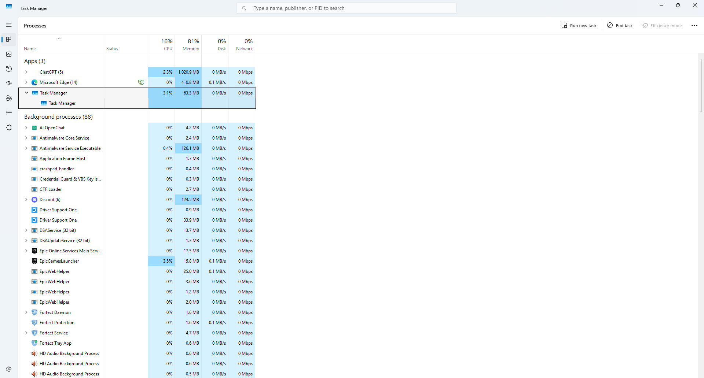
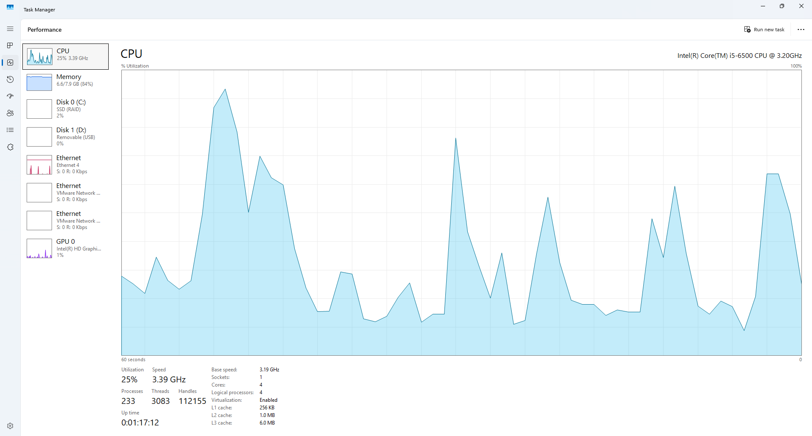
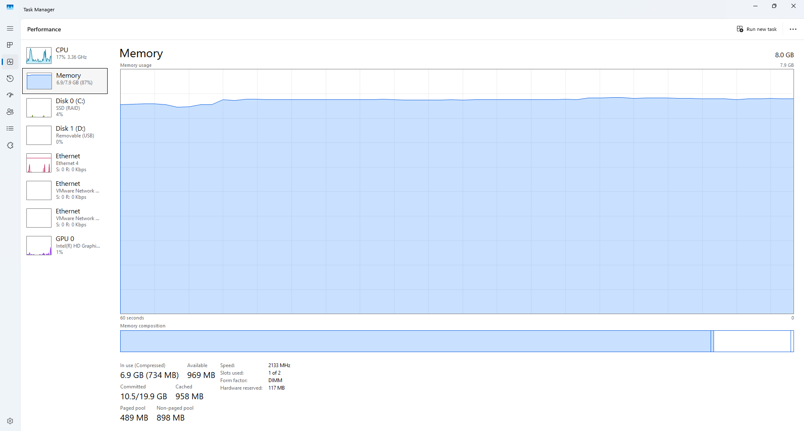
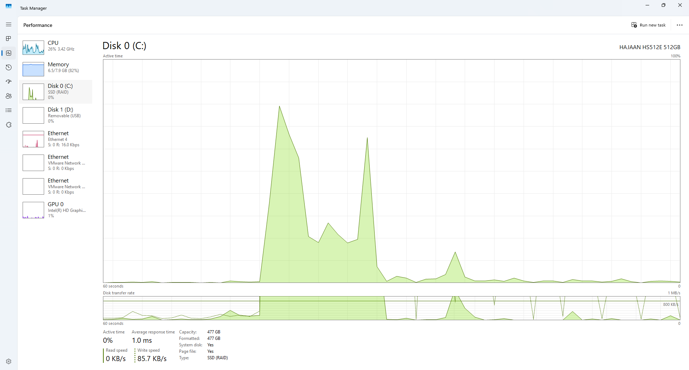
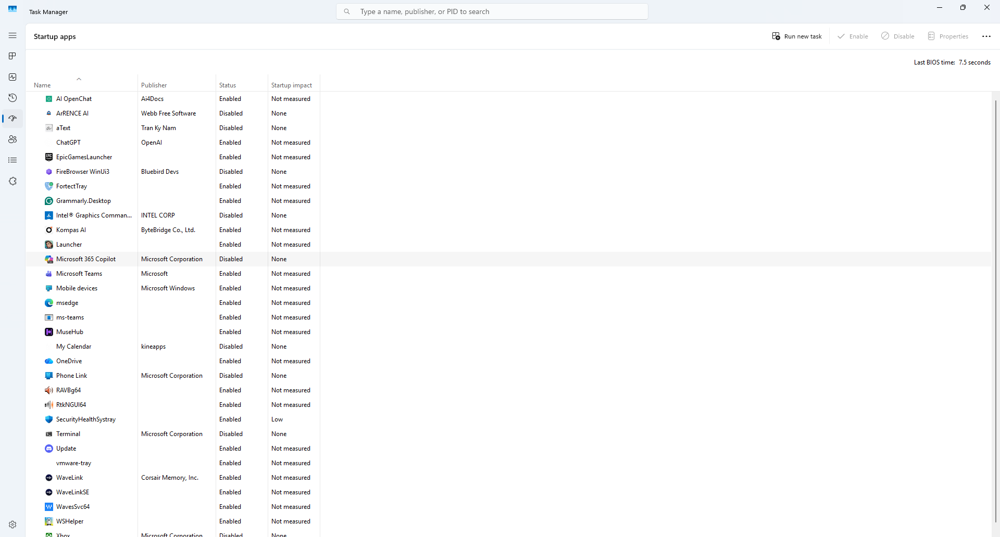
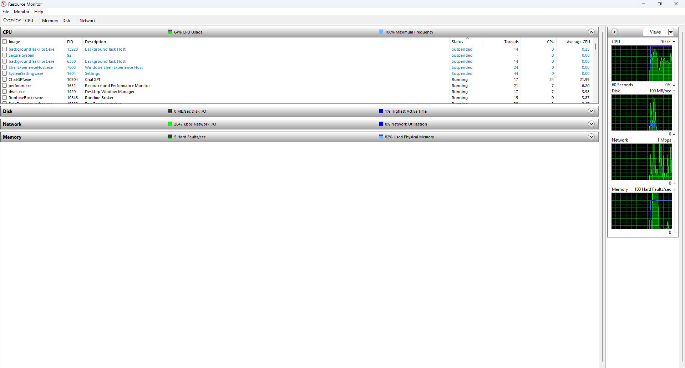
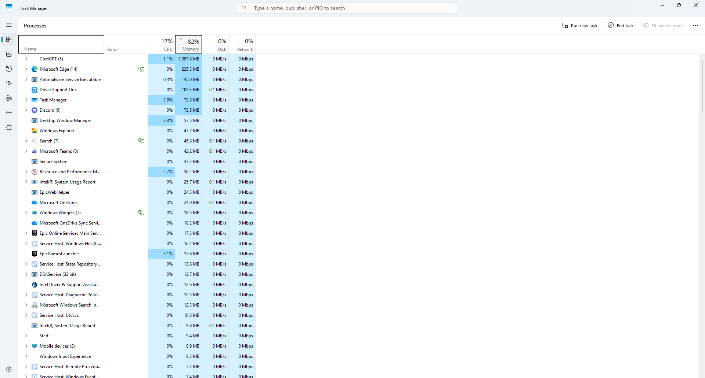

# Darwin Windows Performance Troubleshooting Lab

## Overview

This project demonstrates a common Windows 11 Help Desk troubleshooting scenario involving slow system performance.

The lab walks through identifying resource-intensive applications, monitoring CPU, memory, and disk usage, reviewing startup applications, and using Resource Monitor to diagnose performance bottlenecks.

---

## Skills Demonstrated

- Windows 11 Administration
- Help Desk Troubleshooting
- Task Manager
- Resource Monitor
- CPU Performance Analysis
- Memory Usage Analysis
- Disk Performance Monitoring
- Startup Application Management
- Performance Optimization
- End-User Support

---

## Tools Used

- Windows 11
- Task Manager
- Resource Monitor

---

## Troubleshooting Scenario

### Issue

A user reported that their Windows 11 computer was running slowly, applications were taking longer than normal to open, and system responsiveness had decreased.

### Objective

Identify possible performance bottlenecks and determine which system resources were contributing to the slowdown.

---

## Troubleshooting Steps

### Step 1

Opened **Task Manager** to review running processes.

### Step 2

Reviewed CPU utilization.

### Step 3

Checked Memory usage.

### Step 4

Reviewed Disk activity.

### Step 5

Inspected Startup Applications.

### Step 6

Used **Resource Monitor** for deeper performance analysis.

### Step 7

Identified applications consuming the highest amount of system resources.

---

# Screenshots

## 1. Task Manager Processes

Displayed active applications and background processes.

---

## 2. CPU Performance

Reviewed processor utilization and activity.

---

## 3. Memory Performance

Monitored RAM usage and available memory.

---

## 4. Disk Performance

Observed disk activity and transfer rates.

---

## 5. Startup Applications

Reviewed applications configured to launch during Windows startup.

---

## 6. Resource Monitor

Used Resource Monitor to identify CPU, disk, memory, and network usage.

---

## 7. High Resource Processes

Identified applications consuming the highest amount of system resources.

